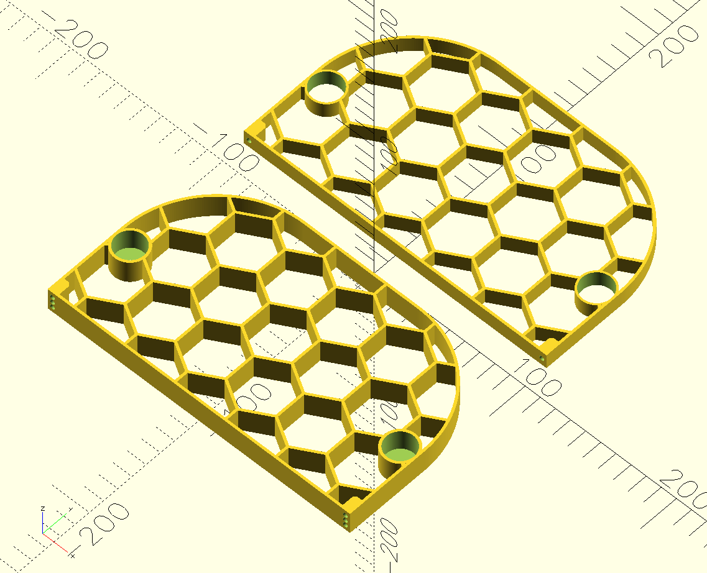
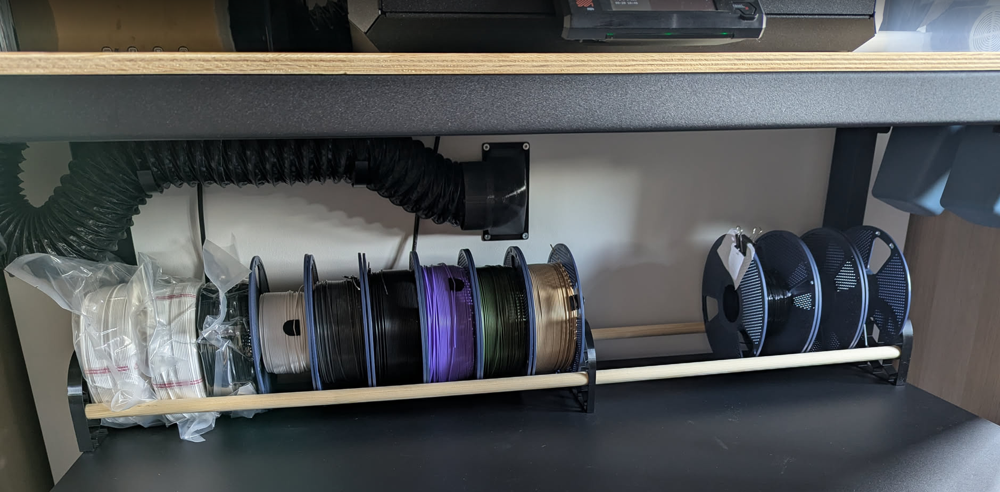

# Simple Filament Rack

_[View on Printables](https://www.printables.com/model/1852333)_

Simple parametric filament rack, making use of wooden dowels for the rail.

Two parts: an end plate with screw holes to secure the dowel, and optional free-moving middle plates for extra stability or organisation.

